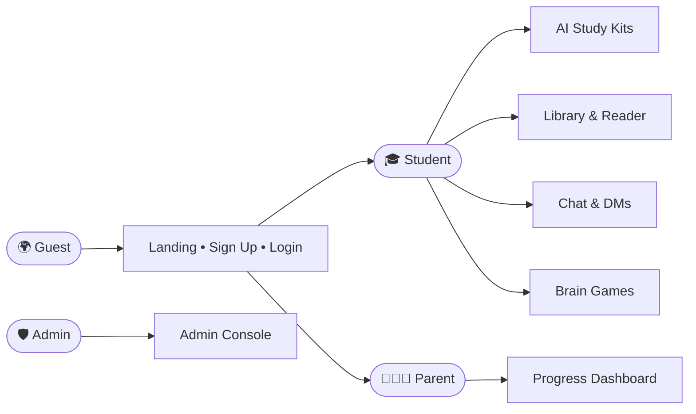
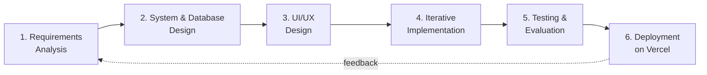
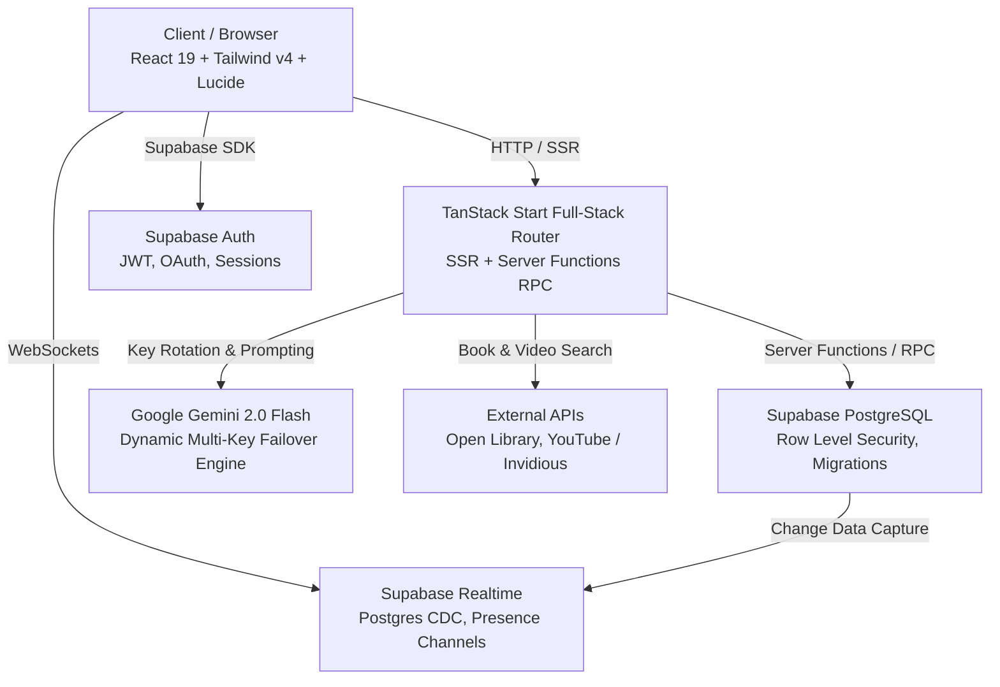
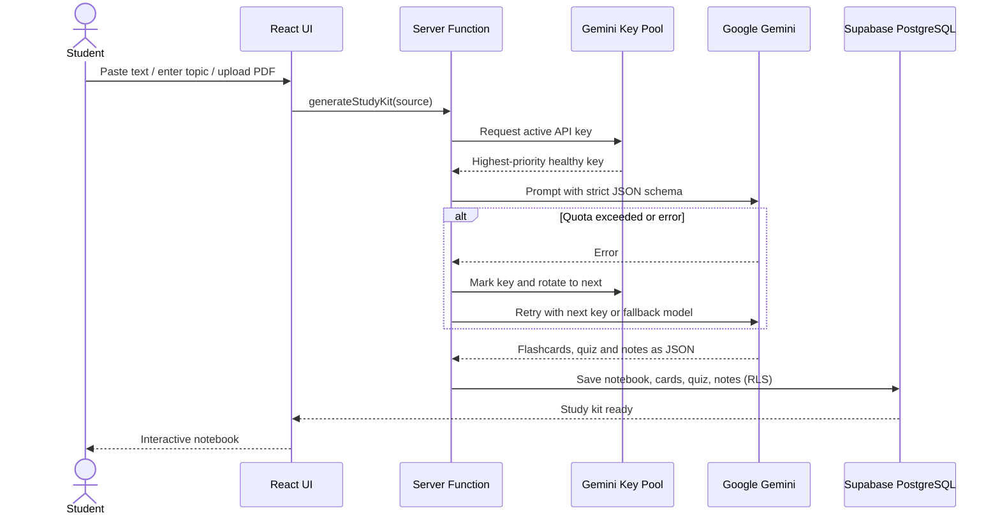
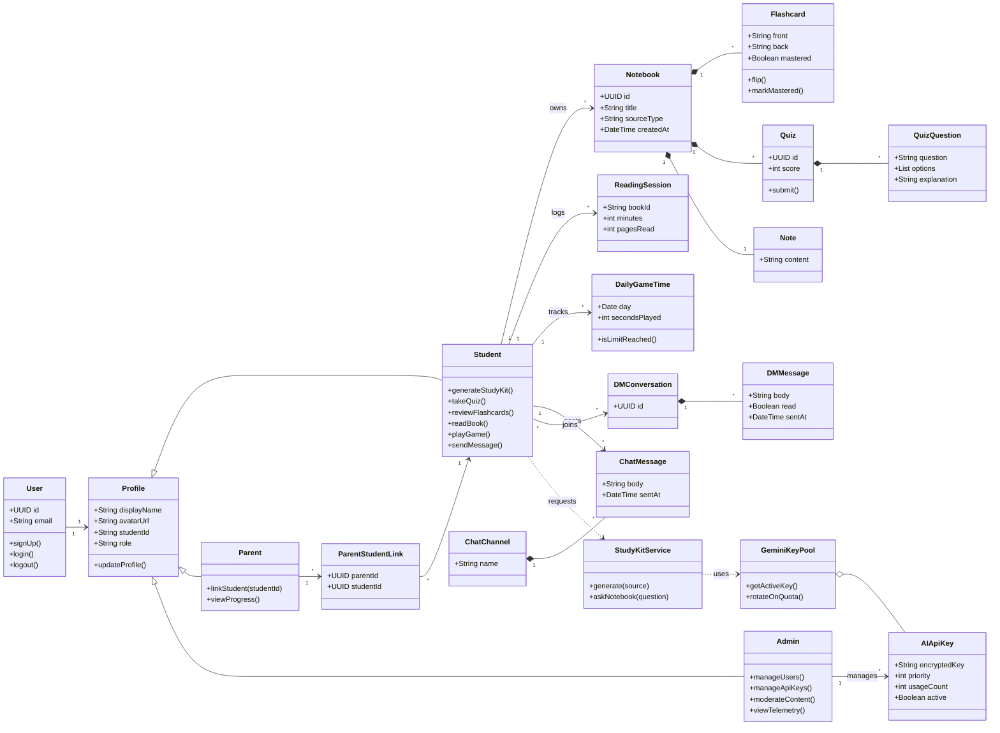

<div align="center">


# 📜 Vellum — Intelligent AI Study & Collaboration Platform

**Transform notes, textbooks, and curiosity into masterable knowledge.**
Powered by **Google Gemini AI**, **TanStack Start (React 19)** and **Supabase Realtime**.

🎓 *Graduation Project — INSA Summer Camp*

<br/>

[](https://vellumstudy.vercel.app)
[](https://eserom.vercel.app)
[](#-project-information)

[](#-acknowledgements)
[](#-project-information)
[](#-key-features)
[](#-key-features)

[](https://react.dev)
[](https://tanstack.com/start)
[](https://www.typescriptlang.org)
[](https://supabase.com)
[](https://tailwindcss.com)
[](https://aistudio.google.com)
[](https://vercel.com)
[](#-license)

<br/>

[🌐 **Live Demo**](https://vellumstudy.vercel.app) &nbsp;•&nbsp; [👨‍💻 **Portfolio**](https://eserom.vercel.app) &nbsp;•&nbsp; [✨ **Features**](#-key-features) &nbsp;•&nbsp; [📸 **Screenshots**](#-uiux-screenshots) &nbsp;•&nbsp; [🧩 **Architecture**](#-class-diagram--system-architecture) &nbsp;•&nbsp; [🚀 **Developer Guide**](#-developer-guide)

<br/>


</div>

---

## 📑 Table of Contents

1. [Project Information](#-project-information)
2. [Introduction](#-introduction)
3. [Statement of the Problem](#-statement-of-the-problem)
4. [Objectives](#-objectives)
5. [Key Features](#-key-features)
6. [System Users](#-system-users)
7. [Limitations](#-limitations)
8. [Methodology](#-methodology)
9. [Functional Requirements](#-functional-requirements)
10. [Non-Functional Requirements](#-non-functional-requirements)
11. [Future Enhancements](#-future-enhancements)
12. [Testing & Evaluation](#-testing--evaluation)
13. [Class Diagram & System Architecture](#-class-diagram--system-architecture)
14. [Technologies Used](#-technologies-used)
15. [UI/UX Screenshots](#-uiux-screenshots)
16. [Unique Features](#-unique-features)
17. [Conclusion](#-conclusion)
18. [Acknowledgements](#-acknowledgements)
19. [Developer Guide](#-developer-guide) *(setup, environment, database, deployment)*
20. [Contributing](#-contributing) • [License](#-license) • [Contact](#-contact)

---

## 🏫 Project Information

<table>
<tr>
<td width="50%" valign="top">

### 👤 Student Information

| Information | Details |
| :--- | :--- |
| **Name** | Eserom Demissew |
| **CTC Number** | CTC-7346-26 |
| **Classroom** | R-003 |
| **Program** | INSA Summer Camp — Graduation Project |
| **Portfolio** | [eserom.vercel.app](https://eserom.vercel.app) |
| **GitHub** | [@eseromdemissew](https://github.com/eseromdemissew) |

</td>
<td width="50%" valign="top">

### 📦 Project Information

| Information | Details |
| :--- | :--- |
| **Project Name** | Vellum |
| **Full Name** | [Vellum — AI Study Notebooks, Flashcards & Practice Quizzes](https://vellumstudy.vercel.app/) |
| **Type** | Individual |
| **Project Type** | 150+ books, 20+ time-limited games, AI study notebooks, flashcards & practice quizzes |
| **Classroom** | R-003 |
| **Development Status** | 🚧 In Development |
| **Department** | Development |
| **Live URL** | [vellumstudy.vercel.app](https://vellumstudy.vercel.app/) |

</td>
</tr>
</table>

---

## 📖 Introduction

**Vellum** is an end-to-end, full-stack educational ecosystem built to help students learn faster, remember more, and study together. The name comes from the fine parchment historically used to preserve knowledge — a fitting symbol for a platform designed to capture, understand and retain it.

By pairing **Google Gemini** models with a real-time reactive architecture, Vellum converts raw study material — from dense textbook PDFs to a few quick bullet points — into an interactive **active-recall study kit** in seconds: flashcards, quizzes, structured notes, an AI assistant that knows your notebook, and hand-picked video lessons.

Beyond the study kit, Vellum brings the whole learning life of a student into one place:

- 💬 **Real-time public channels and private 1-on-1 direct messages**
- 📚 **A digital library of 150+ books** plus an Open Library reader with reading timers
- 👨‍👩‍👧 **A parental oversight dashboard** for healthy, transparent accountability
- 🎮 **20+ brain-break games** with server-enforced daily time limits
- 🛡️ **An enterprise-style admin console** with dynamic multi-key AI pooling

> Vellum was designed, built and deployed solo as my graduation project for the **INSA Summer Camp**.

---

## 🔍 Statement of the Problem

Students today have more information than ever, yet many still study inefficiently. The problems Vellum sets out to solve:

| # | Problem | How Vellum responds |
| :-: | :--- | :--- |
| 1 | **Passive studying** — re-reading notes is slow and weak for memory, and writing flashcards or quizzes by hand takes hours. | AI turns any text, topic or PDF into flashcards, quizzes and notes in a single pass. |
| 2 | **Fragmented tools** — notes, flashcards, videos, books and chat live in different apps, breaking focus. | One workspace that unifies every part of the study workflow. |
| 3 | **Limited access to reading material** — good textbooks and books are expensive or hard to find. | A built-in library of 150+ books plus Open Library & Project Gutenberg search. |
| 4 | **Unbalanced screen time** — entertainment competes with study and nothing enforces healthy limits. | Brain-break games with a server-enforced daily time limit. |
| 5 | **Parents lack visibility** — families can't easily see whether a child is actually studying. | A secure parent dashboard linked through a unique Student ID. |
| 6 | **Language barriers** — most AI study tools are English-only. | Built-in internationalization (English, Amharic and more). |
| 7 | **AI reliability and cost** — a single exhausted API key can bring a platform down. | An admin-managed multi-key Gemini pool with automatic failover. |

---

## 🎯 Objectives

### General Objective
To design and develop a **secure, real-time, AI-powered learning platform** that turns any study material into active-recall resources and supports students, parents and administrators in one accessible web application.

### Specific Objectives
- ✅ Generate **flashcards, multiple-choice quizzes and structured notes** from pasted text, a topic, or an uploaded PDF using Google Gemini with strict JSON schema validation.
- ✅ Provide a **context-aware "Ask Notebook" assistant** grounded in the content of each study kit.
- ✅ Recommend **topic-aware YouTube lessons** and play them in an in-app theater player.
- ✅ Offer a **digital library of 150+ books** and an **Open Library reader** with session timers and study analytics.
- ✅ Enable **real-time communication** through public study channels and private direct messages.
- ✅ Give parents a **secure progress-tracking dashboard** linked via a unique Student ID.
- ✅ Provide **20+ brain-break games** with timezone-aware, server-enforced daily limits.
- ✅ Build an **admin control center** with role-based access control, content moderation, telemetry and multi-key AI pooling.
- ✅ Protect user data with **Row Level Security (RLS)** on every table and encrypted API-key storage.
- ✅ Deliver a **responsive, accessible, multilingual** glassmorphic interface deployed on Vercel.

---

## ✨ Key Features

### 🧠 1. Multi-Source AI Study Kit Generation
- **Any-source ingestion** — paste raw text, type any academic topic, or upload multi-page PDFs.
- **Powered by Google Gemini** — `gemini-2.0-flash` (with robust fallbacks) through the official `@google/generative-ai` SDK and strict JSON schema validation.
- **One-pass generation** of a complete revision suite:
  - 🗂️ **Active-recall flashcards** — interactive 3D flip cards with *Need Review / Mastered* tracking and keyboard navigation.
  - 📝 **Adaptive multiple-choice quizzes** — randomized options, instant feedback, detailed explanations and score tracking.
  - 📖 **Structured revision notes** — chapter headings, bullet points and key takeaways.
  - 🤖 **"Ask Notebook" AI assistant** — conversational AI grounded in the study kit's own content.

### 📺 2. Smart YouTube Video Lessons & Theater Player
- **Topic-aware recommendations** — keywords and core concepts are extracted from your notes to find high-yield tutorials.
- **In-app theater player** — watch without leaving your workspace, with direct YouTube links.
- **Custom topic search** — explore extra lessons without losing your study progress.

### 💬 3. Real-Time Community & Private Direct Messages
- **Private 1-on-1 DMs** with a modern chat layout: sent/received bubbles, timestamps and read states.
- **Live peer discovery** with real-time presence indicators.
- **Public study channels** — `#general`, `#study-tips`, `#questions` — with study-kit sharing.
- **Resilient realtime sync** — Supabase Postgres Realtime combined with short-poll fallback.

### 📚 4. Digital Library & Reader (150+ Books)
- **150+ curated books** plus millions of public-domain titles from **Open Library** and **Project Gutenberg**.
- **Distraction-free reader** with page navigation, zoom and full-screen mode.
- **Reading session timers** that log active minutes, pages and study streaks to your analytics.

### 👨‍👩‍👧 5. Parental Oversight & Progress Tracking
- **Secure student linking** through a unique 6-character Student ID.
- **Real-time analytics** — study streaks, reading hours, completed quizzes and flashcard mastery.
- **Encouragement-first design** that keeps parents involved without being intrusive.

### 🎮 6. Brain Booster & Study-Break Games (20+ Games)
- **20+ puzzles, brain teasers and light arcade games** to refresh focus.
- **Server-enforced daily limits** using heartbeat tracking (e.g. 30 minutes/day).
- **Timezone-aware midnight reset** based on the student's local timezone.

### 🛡️ 7. Admin Control Center & Dynamic Key Pooling
- **Multi-key Gemini pool** — priority tiers, automatic quota failover and encrypted storage in PostgreSQL.
- **Live telemetry** — registrations, notebooks generated, token usage and database health.
- **Role-Based Access Control** for `student`, `parent` and `admin`, enforced by RLS.
- **Content moderation** — review flags and remove violating posts or messages instantly.

### 🎨 8. Glassmorphic UI & Internationalization
- **Ambient glass aesthetic** built with Tailwind CSS v4 across light and dark modes.
- **Multi-language (i18n)** switching, including English and Amharic.
- **Accessible & responsive** — optimized for phones, tablets and ultra-wide monitors using Radix UI primitives.

---

## 👥 System Users

| User | Description | Key Capabilities |
| :--- | :--- | :--- |
| 🌍 **Guest** | Unauthenticated visitor | View the landing page, sign up or log in |
| 🎓 **Student** | Primary learner | Generate and study kits, chat and DM peers, read books, play time-limited games, share a Student ID |
| 👨‍👩‍👧 **Parent** | Guardian of a student | Link a student by Student ID, monitor streaks, reading time, quizzes and mastery |
| 🛡️ **Admin** | Platform operator | Manage users and roles, manage the Gemini key pool, moderate content, view system telemetry |



---

## 🚧 Limitations

Vellum is under active development. Current known limitations:

- **Internet required** — AI generation, realtime chat and cloud sync need a connection; there is no offline mode yet.
- **AI quality depends on input** — generated flashcards and quizzes should be reviewed; large or poorly formatted PDFs may produce weaker results.
- **Scanned PDFs** — image-only PDFs without selectable text are not yet processed with OCR.
- **API quotas** — free-tier Gemini limits can slow generation at peak times; the key pool reduces, but does not remove, this risk.
- **Game limits need connectivity** — daily play-time is enforced by a server heartbeat.
- **Translation coverage** — some interface strings are still English-only while more languages are added.
- **Web only** — no native Android/iOS application yet.
- **Individual project scope** — built and maintained by one developer; load testing at very large scale has not been performed.

---

## 🧭 Methodology

Vellum was built using an **Agile-inspired, iterative and incremental** approach: small, working modules were designed, implemented, tested and deployed continuously, with each release feeding the next iteration.



| Phase | Activities |
| :--- | :--- |
| **1. Requirements Analysis** | Identified student, parent and admin needs; defined functional and non-functional requirements. |
| **2. System & Database Design** | Designed the class diagram, PostgreSQL schema, RLS policies and server-function boundaries. |
| **3. UI/UX Design** | Created the glassmorphic design system, dark/light themes, responsive layouts and accessibility rules. |
| **4. Implementation** | Built module by module — auth → study kits → chat → library → parent → games → admin — using TanStack Start, Supabase and Gemini. |
| **5. Testing & Evaluation** | Functional, integration, security (RLS), usability and responsive testing after every iteration. |
| **6. Deployment** | Continuous deployment to Vercel with Git-based workflow and idempotent Supabase migrations. |

---

## 📋 Functional Requirements

| ID | Module | Requirement |
| :-: | :--- | :--- |
| FR-01 | Authentication | Users shall sign up with email and choose a role (student or parent). |
| FR-02 | Authentication | Users shall log in, log out and keep a secure session. |
| FR-03 | Profile | Users shall edit their display name and avatar, and students shall see their unique Student ID. |
| FR-04 | Access Control | The system shall enforce role-based access for `student`, `parent` and `admin`. |
| FR-05 | Study Kit | The system shall generate a study kit from pasted text. |
| FR-06 | Study Kit | The system shall generate a study kit from a typed topic. |
| FR-07 | Study Kit | The system shall generate a study kit from an uploaded PDF. |
| FR-08 | Flashcards | Users shall flip cards, navigate by keyboard and mark cards *Need Review* or *Mastered*. |
| FR-09 | Quizzes | Users shall take multiple-choice quizzes with instant feedback, explanations and scores. |
| FR-10 | Notes | The system shall present structured revision notes with headings and key takeaways. |
| FR-11 | Ask Notebook | Users shall chat with an AI assistant grounded in the notebook's content. |
| FR-12 | Videos | The system shall recommend topic-related YouTube videos and play them in an in-app theater. |
| FR-13 | Notebooks | Users shall view, open and delete their own notebooks. |
| FR-14 | Chat | Users shall read and post in public study channels in real time. |
| FR-15 | Chat | Users shall exchange private 1-on-1 direct messages in real time. |
| FR-16 | Chat | The system shall show online presence for peers. |
| FR-17 | Library | Users shall search books through Open Library and browse the curated 150+ book collection. |
| FR-18 | Reader | Users shall read books in-app with page navigation, zoom and full-screen. |
| FR-19 | Reader | The system shall log reading time and pages read per session. |
| FR-20 | Parent | Parents shall link to a student using the 6-character Student ID. |
| FR-21 | Parent | Parents shall view study streaks, reading hours, quiz results and mastery metrics. |
| FR-22 | Games | Students shall play from a library of 20+ brain-break games. |
| FR-23 | Games | The server shall enforce a daily play-time limit and reset it at local midnight. |
| FR-24 | Admin | Admins shall add, prioritize and rotate multiple Gemini API keys. |
| FR-25 | Admin | Admins shall view platform telemetry (users, notebooks, usage). |
| FR-26 | Admin | Admins shall manage user roles and moderate flagged content. |
| FR-27 | Localization | Users shall switch the interface language at runtime. |
| FR-28 | Theming | Users shall toggle between light and dark mode. |

---

## 🔧 Non-Functional Requirements

| Category | Requirement | How Vellum delivers it |
| :--- | :--- | :--- |
| **Performance** | Fast loads and snappy interactions | SSR with TanStack Start, Vite bundling, TanStack Query caching and optimistic updates |
| **Scalability** | Handle growing users and AI demand | Serverless deployment on Vercel, managed PostgreSQL, multi-key AI pool |
| **Security** | Protect accounts and data | Supabase Auth (JWT), RLS on every table, encrypted API keys, server-only secrets |
| **Privacy** | Users see only their own data | RLS isolates notebooks and private messages per user |
| **Reliability** | Keep AI available under quota limits | Automatic Gemini key failover and model fallback cascade |
| **Usability** | Easy for students of all ages | Clean glassmorphic UI, clear navigation, keyboard shortcuts for flashcards |
| **Accessibility** | Inclusive interaction | Radix UI accessible primitives, semantic HTML, high-contrast themes |
| **Responsiveness** | Works on any device | Mobile-first layouts for phones, tablets and wide desktop screens |
| **Compatibility** | Run in modern browsers | Standards-based React 19 and Tailwind v4 output |
| **Maintainability** | Easy to extend and debug | Strict TypeScript, modular route and server-function structure, ESLint and Prettier |
| **Localization** | Serve multiple languages | Central i18n dictionary with runtime language switching |
| **Real-time** | Instant message delivery | Supabase Realtime (Postgres CDC and presence) with polling fallback |

---

## 🔮 Future Enhancements

| Horizon | Planned Enhancement |
| :--- | :--- |
| 🟢 **Short term** | Spaced-repetition scheduling (SM-2) for flashcards · OCR for scanned PDFs · export decks to PDF / Anki · push and email study reminders |
| 🟡 **Mid term** | Installable PWA with offline mode · teacher and classroom role with assignments · leaderboards, badges and XP · more languages (Afaan Oromoo, Tigrinya) |
| 🔴 **Long term** | Native Android and iOS apps · voice-based AI tutor · live group study rooms with video · adaptive learning paths driven by performance analytics |

---

## 🧪 Testing & Evaluation

### Testing Strategy

| Type | Scope | Approach |
| :--- | :--- | :--- |
| **Functional testing** | Every user flow per role | Manual test cases for auth, study kits, chat, library, parent, games and admin |
| **Integration testing** | Client ↔ server functions ↔ Supabase ↔ Gemini | End-to-end runs of generation, realtime delivery and key failover |
| **Security testing** | RLS, roles and secrets | Verified that users cannot read other users' notebooks or DMs and that admin routes reject non-admins |
| **AI output validation** | Gemini responses | Strict JSON-schema validation with model and key fallback on failure |
| **Usability testing** | Navigation and clarity | Walkthroughs with peers to refine the study-kit composer and dashboard |
| **Responsive & browser testing** | Phone, tablet, desktop | Checked layouts and themes on modern browsers and multiple screen sizes |

### Sample Test Cases

| ID | Module | Scenario | Expected Result | Status |
| :-: | :--- | :--- | :--- | :-: |
| TC-01 | Auth | Sign up as student with valid details | Account created and redirected to dashboard | ✅ Pass |
| TC-02 | Auth | Log in with wrong password | Clear error message, no session | ✅ Pass |
| TC-03 | Study Kit | Generate from pasted text | Flashcards, quiz and notes are created and saved | ✅ Pass |
| TC-04 | Study Kit | Generate from a PDF | Text extracted and a full study kit generated | ✅ Pass |
| TC-05 | Flashcards | Mark a card as *Mastered* | Progress updates and persists | ✅ Pass |
| TC-06 | Quiz | Submit an answer | Instant feedback with explanation and updated score | ✅ Pass |
| TC-07 | Ask Notebook | Ask a question about the notes | Answer grounded in notebook content | ✅ Pass |
| TC-08 | Chat | Send a private DM | Message appears instantly for both users | ✅ Pass |
| TC-09 | Security | User A requests User B's notebook | Access denied by RLS | ✅ Pass |
| TC-10 | Library | Search for a book | Relevant results with details drawer | ✅ Pass |
| TC-11 | Reader | Read a book for several minutes | Reading session logged to analytics | ✅ Pass |
| TC-12 | Parent | Link a student with a valid Student ID | Student progress visible on parent dashboard | ✅ Pass |
| TC-13 | Games | Exceed the daily play-time limit | Games lock until the local midnight reset | ✅ Pass |
| TC-14 | Admin | Exhaust the primary Gemini key | System fails over to the next key automatically | ✅ Pass |
| TC-15 | Admin | Non-admin opens `/admin` | Access denied | ✅ Pass |
| TC-16 | i18n | Switch language to Amharic | Interface text updates immediately | ✅ Pass |

### Evaluation Criteria

| Criterion | Question asked | Outcome |
| :--- | :--- | :--- |
| **Correctness** | Do generated kits match the source material? | Schema validation plus review keeps output structured and relevant |
| **Security** | Is each user's data isolated? | RLS verified across tables and roles |
| **Performance** | Do pages and AI generation feel fast? | SSR, caching and a fast Gemini model keep waits short |
| **Usability** | Can a new student succeed without help? | Study-kit creation takes just a few clicks |
| **Reliability** | Does the app survive API limits? | Key pool and model fallback keep generation available |

---

## 🧩 Class Diagram & System Architecture

### System Architecture



### Study Kit Generation Flow



### Class Diagram



### Database Overview

| Table | Description |
| :--- | :--- |
| `profiles` | User profile with `display_name`, `avatar_url`, `student_id` and role |
| `user_roles` | Role assignments (`student`, `parent`, `admin`) |
| `notebooks` | Master record for every AI study kit |
| `flashcards` | Active-recall cards with front/back text and mastery score |
| `quizzes` / `quiz_questions` | Multiple-choice quizzes with options and explanations |
| `notes` | Formatted study guides and chapter summaries |
| `chat_channels` / `chat_messages` | Public discussion lounges with Realtime enabled |
| `dm_conversations` / `dm_messages` | Private 1-on-1 messaging |
| `reading_sessions` | Duration, book ID and pages read for library analytics |
| `parent_student_links` | Links parent accounts to students via Student ID |
| `ai_api_keys` | Encrypted multi-key Gemini pool with usage counters and priority |
| `daily_game_time` | Daily game play time with timezone-aware reset |

---

## 💻 Technologies Used

| Layer | Technology | Purpose |
| :--- | :--- | :--- |
| **Framework** | [TanStack Start](https://tanstack.com/start) + [Vite](https://vitejs.dev) | Full-stack React with type-safe routing, SSR and RPC server functions |
| **UI Library** | [React 19](https://react.dev) | Latest hooks, actions and compiler optimizations |
| **Language** | [TypeScript](https://www.typescriptlang.org) (strict) | Type safety across client and server |
| **Styling** | [Tailwind CSS v4](https://tailwindcss.com), Radix UI, Lucide Icons | Design tokens, accessible primitives, glassmorphism |
| **State & Data** | [TanStack Query v5](https://tanstack.com/query) | Caching, optimistic mutations, automatic refetching |
| **AI** | [Google Gemini 2.0 Flash](https://aistudio.google.com) via `@google/generative-ai` | Structured study-kit generation with key rotation and fallback |
| **Database & Auth** | [Supabase](https://supabase.com) (PostgreSQL 15+) | RLS, Realtime channels, Storage and Auth |
| **Books** | Open Library, Project Gutenberg | Public-domain book search and reading |
| **Videos** | YouTube / Invidious | Topic-aware lesson recommendations |
| **Deployment** | [Vercel](https://vercel.com) (Nitro preset) | Serverless SSR and global CDN |
| **Tooling** | ESLint, Prettier, Git & GitHub | Code quality and version control |

---

## 📸 UI/UX Screenshots

<!--
  SCREENSHOT FOLDER:  docs/screenshots/
  Every  below must match a real file name exactly (case-sensitive).
-->

Vellum's interface uses a **glassmorphic design system** with ambient blur, fluid dark/light themes, accessible components and a mobile-first layout. Below is every page of the application.

### 🏠 Public & Authentication

<table>
<tr>
<td align="center" width="50%"><b>1 · Landing Page</b><br/></td>
<td align="center" width="50%"><b>2 · Sign Up (Role Selection)</b><br/></td>
</tr>
<tr>
<td align="center" width="50%"><b>3 · Login</b><br/></td>
<td align="center" width="50%"><b>4 · Student Dashboard & Study Kit Composer</b><br/></td>
</tr>
</table>

### 🧠 AI Study Notebook

<table>
<tr>
<td align="center" width="50%"><b>5 · Flashcards (3D Flip & Mastery)</b><br/></td>
<td align="center" width="50%"><b>6 · Practice Quiz</b><br/></td>
</tr>
<tr>
<td align="center" width="50%"><b>7 · Revision Notes</b><br/></td>
<td align="center" width="50%"><b>8 · Ask Notebook (AI Assistant)</b><br/></td>
</tr>
<tr>
<td align="center" width="50%"><b>9 · YouTube Video Lessons & Theater Player</b><br/></td>
<td></td>
</tr>
</table>

### 💬 Community

<table>
<tr>
<td align="center" width="50%"><b>10 · Public Study Channels</b><br/></td>
<td align="center" width="50%"><b>11 · Private Direct Messages</b><br/></td>
</tr>
</table>

### 📚 Library & Reader

<table>
<tr>
<td align="center" width="50%"><b>12 · Digital Library (150+ Books)</b><br/></td>
<td align="center" width="50%"><b>13 · Book Reader with Session Timer</b><br/></td>
</tr>
</table>

### 👨‍👩‍👧 Parent Portal

<table>
<tr>
<td align="center" width="50%"><b>14 · Parent Progress Dashboard</b><br/></td>
<td></td>
</tr>
</table>

### 🎮 Brain Games

<table>
<tr>
<td align="center" width="33%"><b>15 · Games Hub (20+ Games)</b><br/></td>
<td align="center" width="33%"><b>16 · Game in Play (Timer)</b><br/></td>
<td align="center" width="33%"><b>17 · Daily Limit Reached</b><br/></td>
</tr>
</table>

### 🛡️ Admin & Settings

<table>
<tr>
<td align="center" width="50%"><b>18 · Admin Overview & Telemetry</b><br/></td>
<td align="center" width="50%"><b>19 · AI Key Pool Management</b><br/></td>
</tr>
<tr>
<td align="center" width="50%"><b>20 · Settings & Profile</b><br/></td>
<td></td>
</tr>
</table>

### 🌗 Themes, Mobile & Languages

<table>
<tr>
<td align="center" width="50%"><b>21 · Dark Mode</b><br/></td>
<td align="center" width="50%"><b>22 · Light Mode</b><br/></td>
</tr>
<tr>
<td align="center" width="50%"><b>23 · Mobile Responsive View</b><br/></td>
<td align="center" width="50%"><b>24 · Amharic Language (i18n)</b><br/></td>
</tr>
</table>

---

## 💎 Unique Features

| Feature | Typical study tools | **Vellum** |
| :--- | :--- | :---: |
| AI study kit (flashcards + quiz + notes) from text, topic **and** PDF in one pass | Usually one format at a time | ✅ |
| "Ask Notebook" AI grounded in *your* notes | Generic chatbot | ✅ |
| Multi-key Gemini pool with priority and automatic quota failover | Single key, single point of failure | ✅ |
| Server-enforced daily game limit with timezone-aware midnight reset | Honor-system timers | ✅ |
| Parent linking through a unique 6-character Student ID | Rare or absent | ✅ |
| In-app YouTube theater player with topic-aware recommendations | External links only | ✅ |
| Real-time private DMs and public channels inside the study workspace | Separate chat apps | ✅ |
| 150+ books plus Open Library reader with reading-session analytics | Not included | ✅ |
| Row Level Security on every table and encrypted AI keys | Varies | ✅ |
| Amharic and multi-language interface | English-first | ✅ |
| One unified platform for students, parents and admins | Single audience | ✅ |

---

## 🏁 Conclusion

Vellum shows that a single developer, with the right tools and a clear purpose, can build a **complete, production-style learning platform**. It converts passive reading into active recall, keeps students connected and accountable, gives parents meaningful visibility, protects privacy with Row Level Security, and keeps AI reliable through intelligent key pooling.

Building Vellum taught me full-stack development with React 19 and TanStack Start, secure database design with PostgreSQL and RLS, real-time systems, prompt engineering with structured AI output, and the discipline of shipping a product from idea to live deployment.

Vellum is still **in development**, and the roadmap — spaced repetition, OCR, a PWA, classroom tools and more languages — shows where it is heading. My goal is simple: **make quality learning smarter, healthier and accessible to every student.**

---

## 🙏 Acknowledgements

<div align="center">

### First and above all, thank You, God. 🙏

*For the strength, wisdom, health and patience to start this journey and to finish it.*

</div>

I want to express my deepest gratitude and **big love ❤️ to INSA** — the Information Network Security Administration — for the **INSA Summer Camp**. Thank you for the opportunity, the world-class training, the mentorship, and for believing in young Ethiopian talent. This graduation project is a direct result of what I learned, who I met, and the standard of excellence the camp inspired in me.

Thank you to:

- 🏛️ **INSA**, the organizers and every trainer and mentor of the Summer Camp for their guidance and dedication.
- 👥 **My classmates and friends in Classroom R-003** for the teamwork, support and shared laughter.
- 👨‍👩‍👧 **My family** for their constant love, prayers and encouragement.
- 💻 **The open-source community and platforms** — Google Gemini, Supabase, TanStack, React, Tailwind CSS, Radix UI, Vercel, Open Library and Project Gutenberg — whose work makes projects like this possible.

> *"I am proud to be part of the INSA Summer Camp family — and this is only the beginning."*
> — **Eserom Demissew**, CTC-7346-26 · Classroom R-003

---

## 🚀 Developer Guide

### Prerequisites
- **Node.js** `v18.18.0` or later (`v20+` recommended)
- **npm**, **pnpm** or **yarn**
- A free [Supabase](https://supabase.com) project
- A free Gemini API key from [Google AI Studio](https://aistudio.google.com)

### Quick Start

```bash
# 1. Clone the repository
git clone https://github.com/eseromdemissew/Vellum-Study.git
cd Vellum-Study

# 2. Install dependencies
npm install

# 3. Create your environment file
cp .env.example .env
# …then fill in your Supabase and Gemini credentials

# 4. Start the development server
npm run dev
```

Open **http://localhost:5173** in your browser.

### Initialize the Database
1. Open your project in the [Supabase Dashboard](https://supabase.com/dashboard).
2. Go to the **SQL Editor**.
3. Paste the entire contents of [`supabase/setup.sql`](supabase/setup.sql).
4. Click **Run** — this creates all tables, RLS policies, triggers and Realtime publications.

<details>
<summary><b>🔑 Environment Variables</b></summary>

<br/>

| Variable | Scope | Description | Required |
| :--- | :--- | :--- | :-: |
| `VITE_SUPABASE_URL` | Client | Supabase project URL | **Yes** |
| `VITE_SUPABASE_PUBLISHABLE_KEY` | Client | Supabase anonymous / publishable key | **Yes** |
| `SUPABASE_URL` | Server | Supabase URL for server-side functions | **Yes** |
| `SUPABASE_SERVICE_ROLE_KEY` | Server | Service-role key for admin tasks and key encryption | **Yes** |
| `GEMINI_API_KEY` | Server | Primary Gemini key (more can be added in the Admin UI) | Optional |
| `GEMINI_MODEL` | Server | Model name (default `gemini-2.0-flash`) | Optional |
| `VITE_SITE_URL` | Client | Canonical URL, e.g. `https://vellumstudy.vercel.app` | Optional |
| `VITE_GA_MEASUREMENT_ID` | Client | Google Analytics 4 Measurement ID | Optional |

> ⚠️ Never commit your `.env` file or expose `SUPABASE_SERVICE_ROLE_KEY` to the client.

</details>

<details>
<summary><b>📁 Repository Structure</b></summary>

```
Vellum-Study/
├── docs/
│   └── screenshots/            # UI/UX screenshots used in this README
├── public/                     # Static assets, logos, favicons
├── src/
│   ├── components/
│   │   ├── games/              # Study-break games & timers
│   │   ├── library/            # Open Library search & detail drawers
│   │   ├── reader/             # Book reader with session timers
│   │   ├── ui/                 # Radix UI + glassmorphic design system
│   │   ├── AppHeader.tsx       # Navigation shell, role switch, theme toggle
│   │   └── theme.tsx           # Light / dark theme provider
│   ├── hooks/                  # useAuth, useLocalStorage, …
│   ├── integrations/supabase/  # Browser & SSR Supabase clients
│   ├── lib/
│   │   ├── chat.functions.ts       # Channels & private DMs
│   │   ├── gemini.server.ts        # Gemini key pool, fallbacks, AI calls
│   │   ├── study.functions.ts      # Study-kit generator, quiz grader, AI assistant
│   │   ├── library.functions.ts    # Open Library queries & reading timers
│   │   ├── platform.functions.ts   # Admin stats, key rotation, user management
│   │   └── i18n.tsx                # Localization dictionaries
│   └── routes/
│       ├── __root.tsx                # Root layout, Query provider, toaster
│       ├── index.tsx                 # Landing page
│       ├── dashboard.tsx             # Study-kit composer & recent notebooks
│       ├── notebook.$notebookId.tsx  # Flashcards, quiz, notes, AI chat, videos
│       ├── chat.tsx                  # Public channels & private DMs
│       ├── library.tsx               # Digital library
│       ├── read.$bookId.tsx          # In-app reader
│       ├── parent.tsx                # Parent oversight
│       ├── games.tsx                 # Brain-break games
│       ├── admin.tsx                 # Key pool, users, metrics
│       ├── login.tsx / signup.tsx    # Authentication
│       └── settings.tsx              # Profile, Student ID, avatar
├── supabase/
│   ├── setup.sql               # Idempotent schema & RLS policies
│   └── migrations/             # Incremental migrations
├── .env.example
├── package.json
├── tsconfig.json
└── vite.config.ts
```

</details>

<details>
<summary><b>🛠️ Available Scripts</b></summary>

<br/>

| Command | Action |
| :--- | :--- |
| `npm run dev` | Start the Vite dev server with HMR |
| `npm run build` | Build the production bundle |
| `npm run build:vercel` | Build for Vercel serverless deployment |
| `npm run preview` | Preview the production build locally |
| `npm run lint` | Run ESLint |
| `npm run format` | Run Prettier |

</details>

<details>
<summary><b>🚢 Deployment to Vercel</b></summary>

<br/>

1. Push the repository to GitHub.
2. Import it at [vercel.com/new](https://vercel.com/new).
3. Set the framework preset to **Vite** or **Other**.
4. Add the environment variables listed above.
5. Deploy — the `vercel.json` and Nitro configuration handle serverless SSR and asset routing.

</details>

<details>
<summary><b>👑 Make an Account Admin</b></summary>

<br/>

```sql
INSERT INTO public.user_roles (user_id, role)
SELECT id, 'admin' FROM auth.users WHERE email = 'your-email@example.com'
ON CONFLICT (user_id, role) DO NOTHING;
```

</details>

### 🔒 Security & Privacy
- **Row Level Security** is enabled on every table — students only access their own study kits and private messages.
- **Encrypted API keys** — Gemini keys added in the Admin portal are stored encrypted with a server secret.
- **Server-only secrets** — service-role and AI keys never reach the browser.
- **AI data handling** — user content is sent to the Gemini API only to generate study material and is subject to Google's Gemini API terms; please avoid submitting sensitive personal information.

---

## 🤝 Contributing

Contributions, issues and feature requests are welcome! Check the [issues page](https://github.com/eseromdemissew/Vellum-Study/issues).

1. Fork the project
2. Create a feature branch — `git checkout -b feature/AmazingFeature`
3. Commit your changes — `git commit -m "feat: add some AmazingFeature"`
4. Push to the branch — `git push origin feature/AmazingFeature`
5. Open a Pull Request

---

## 📄 License

Distributed under the **MIT License**. See the `LICENSE` file for more information.

---

## 📬 Contact

<div align="center">

**Eserom Demissew** — Developer of Vellum
*INSA Summer Camp • CTC-7346-26 • Classroom R-003*

[](https://eserom.vercel.app)
[](https://github.com/eseromdemissew)
[](https://vellumstudy.vercel.app)

<br/>

⭐ **If you like Vellum, please give the repository a star — it means a lot!** ⭐

<br/>

**Crafted with 💜 for students and educators worldwide.**
*Thank you, INSA. Thank you, God.* 🙏


</div>
